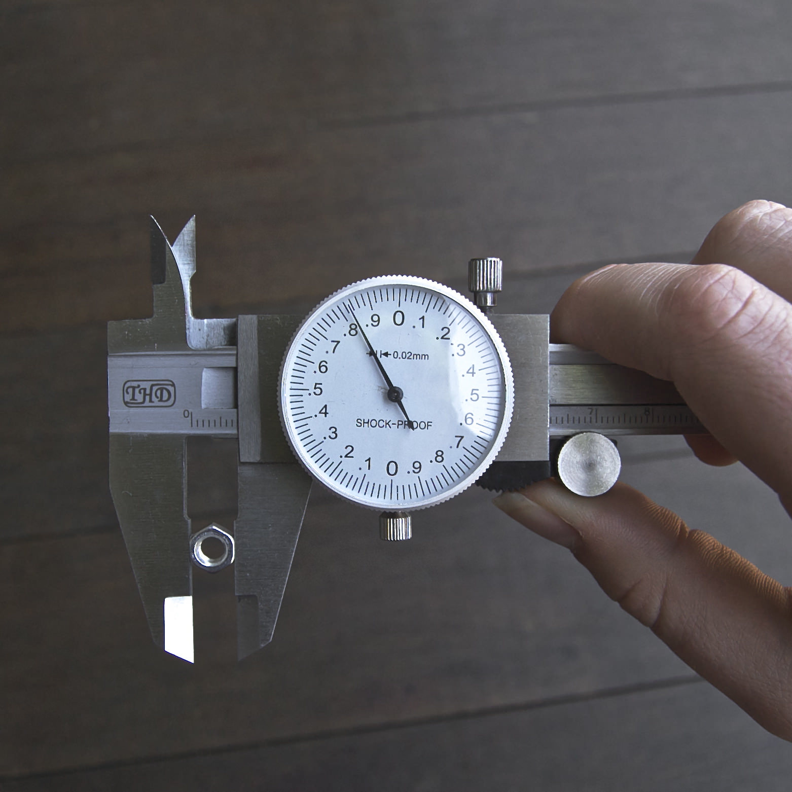

OpenSCAD is a neat free tool which compiles programs in it's own language to solid 2D or 3D vector shapes suitable for 3D printers and CNCs. Just one hitch - the language is horrible! There are all sorts of wacky constructs like things they call variables which can't vary their values, and an odd but kinda funky calling convention where named arguments can also be left unnamed if you get the order of the arguments right, which is impossible sometimes because openscad had different ordering in different versions!

Simple things like making a cube with rounded corners are difficult to make with precision and often unusably slow to compute. It's necessary to have the OpenSCAD manual at hand to lookup argument names and data formats. Small bugs in your program will often not cause any useful error messages in OpenSCAD - instead it will compute gibberish, or nothing at all, or even segfault!

[Oozby](https://github.com/Bluebie/oozby) is my little fix to make OpenSCAD funner. It gives you all the power of OpenSCAD with the lovely syntax of Ruby. Oozby validates your code to help catch errors before they get to OpenSCAD and give useful feedback saving hours in debugging. Oozby patches in a bunch of extra features, like primitives with rounded corners (squares, cubes, cylinders). Oozby tries to understand your intent, so you don't need a cheat sheet to look up precise names for arguments or methods, but if you get something wrong, it'll try and help you. If you call an unknown method, oozby will suggest if it knows of one with a similar name.

Oozby will figure out that `cylinder()` takes `r:`, not `radius:` and rename it. Or maybe you specified a `diameter:` oozby halved it for you before renaming it to `r:`. Maybe you want a cube with rounded off corners? Oozby saw you passed a `corner_radius:` argument to `cube(5.0, corner_radius: 1.0)` and automatically output the dozens of OpenSCAD instructions required to make the exact cube you asked for. Oozby constructed that rounded cube using the most optimized OpenSCAD instructions I've yet found, so your model compiles in seconds instead of minutes.

So you can see what oozby code looks like, lets make a spanner for some M5 nuts I found at a dollar shop. First I measured the nut diameter, then made a little oozby program. As I wrote the file, the oozby command line app watched my changes, and each time I saved the .oozby file it compiled a .scad file which OpenSCAD automatically reloaded, so I could always see what I was building with the 3D view in OpenSCAD.



```
nut = 8.0 # nut was 7.83mm across on my callipers

resolution minimum: 0.5 # smoother quality

# set the default origin to center, not corner
defaults(center: true) do
  # boolean operation:
  difference do
    # combine these two shapes first
    union do
      # make the round spanner tool shape, with
      # corner_radius rounding
      cylinder(height: 5, diameter: nut * 2, cr: 1.5)
      # add a handle
      translate(x: -50 / 2) >
      cube(x: 50, y: nut, z: 5, corner_radius: 2)
    end
    # and remove the rest from it:
    hull do # hull combines these two like shrink wrap
      # making a nice elongated shape to cut out
      hexagonal_prism(inner_diameter: nut, height: 10)
      # the greater than operator is a shortcut for
      # do/end block containing next thing after it
      translate(x: nut * 2) > # shift over a bit
      hexagonal_prism(id: nut, h: 10) # h == height
    end
  end
end
```


When I was done I asked OpenSCAD to render it, so I could save an STL file and 3D Print out my new spanner. It took 32 seconds to compute the final render, even with all the nicely rounded off shapes.

Some more in depth documentation for oozby will come in the future most likely. If you play with it give me a buzz on [twitter](https://twitter.com/Bluebie) or [github](https://github.com/Bluebie/oozby/issues) if you have any feedback!